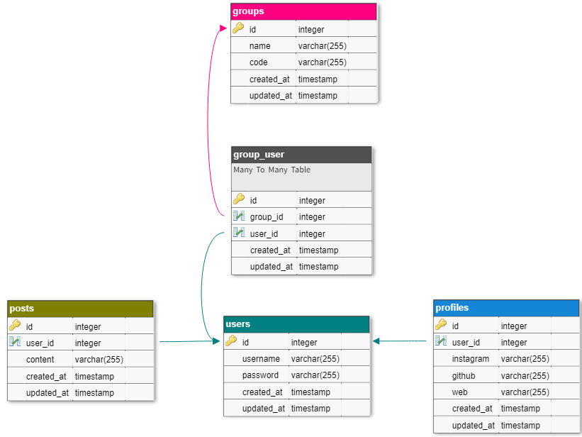

## Table of Contents

- [Table of Contents](#table-of-contents)
- [Database Structure](#database-structure)
- [Route List Table](#route-list-table)
- [Petunjuk](#petunjuk)
- [Referensi](#referensi)

## Database Structure



## Route List Table

Table of routes and their corresponding methods.

| Method   | URI                                      | Fungsi                                               |
| :---     | :---                                     | :---                                                 |
| GET      | <http://127.0.0.1:8000/readme>             | Go to readme page                                    |
| GET      | <http://127.0.0.1:8000/users>              | Menampilkan semua users dan halaman add user         |
| POST     | <http://127.0.0.1:8000/users/store>        | Menambah user baru                                   |
| POST     | <http://127.0.0.1:8000/users/update>       | Update data user (username, github, instagram & web) |
| GET      | <http://127.0.0.1:8000/users/{id>}         | Menampilkan data profile, group, post                |
| GET      | <http://127.0.0.1:8000/posts>              | Menampilkan semua posts oleh semua user              |
| POST     | <http://127.0.0.1:8000/posts/delete/{id>}  | Delete post berdasarkan id                           |
| POST     | <http://127.0.0.1:8000/posts/store>        | Menambah post baru                                   |
| GET      | <http://127.0.0.1:8000/groups>             | Menampilkan semua groups dan halaman add group       |
| POST     | <http://127.0.0.1:8000/groups/join>        | Join group                                           |
| POST     | <http://127.0.0.1:8000/groups/leave>       | Leave group                                          |
| POST     | <http://127.0.0.1:8000/groups/store>       | Menambah group baru                                  |
| GET      | <http://127.0.0.1:8000/groups/{code>}      | Get group by code                                    |

## Petunjuk

1. Jalankan command `Composer Install`
2. Buat Database dengan nama `tutor_fpw` sesuai dengan nama database pada .env
3. Jalankan command `php artisan migrate:fresh` atau `php artisan migrate:fresh --seed` atau import database manual 😊
4. Jalankan command `php artisan serve`
5. Model & Eloquent :
   - Model memberikan user untuk dapat melakukan query data dari tabel pada database seperti create, update, delete, etc.
   - Eloquent adalah object-relational mapper (ORM) yang mengatur hubungan antara model dan database, dengan Eloquent setiap tabel pada database akan direpresentasikan sebagai model.
   - Configure database connection di `config/database.php`
   - Cara buat model : `php artisan make:model <nama_model>`
   - File model pada project terletak pada `app/Models/<nama_model>.php`
   - Tutor ini menggunakan 4 model : User, Profile, Posts, Group
   - Attributes :
     ```
     class User extends Model { 
       protected $table = '<nama_table>' // untuk mengubah nama tabel (default: bentuk plural dari nama model)
       protected $primaryKey = '<nama_primar_key>' // untuk mengubah nama primary key (default: id)
       public $incrementing = '<boolean>' // untuk mengubah primary key menjadi incrementing (default: true)
       public $timestamps = '<boolean>' // untuk menambahkan kolom created_at & updated_at (default: true)
       public $fillable = ['<nama_kolom>', ...] // untuk define nama kolom yang dapat diisi untuk Mass Assignment
       // etc ...
     }
     ```
   - Get Data :
     ```
     $users = User::all(); // Mendapatkan semua users
     $users = User::where('status', 1)->get() // Bisa menggunakan Query Builder
     $user = User::first()` // Mendapatkan user pertama
     ```
   - Insert Data
     ```
     // Save
     $user = new User;
     $user->username = $request->username;
     $user->password = $request->password;
     $user->save();

     // Mass Assignment (Harus menggunakan salah satu attribute fillable / guarded di model)
     $user = User::create([
         'username' => $request->username,
         'password' => $request->password
     ]);

     ```
   - Update Data
     ```
     $user = User::find($id);
     $user->username = 'Updated username';
     $user->save();
     ```
   - Delete Data
     ```
     // simple delete
     $user = User::find($id);
     $user->delete();

     // delete by primary key 
     User::destroy($id);
     User::destroy($id, $id2, $id3)
     User::destroy([$id, $id2, $id3])

     // delete by query
     User::where('username', 'abc')->delete();
     ```
   - Soft Delete
     ```
     use Illuminate\Database\Eloquent\SoftDeletes;
     class ... extends Model { 
        use SoftDeletes; // untuk menggunakan soft deletes (menambahkan kolom deleted_at)
        ...
     }
6. Relationships
   - One To One
     ```
     class User extends Model
     {
        public function profile()
        {
            // ONE TO ONE
            // keyword: hasOne dan belongsTo
            // Jika foreign key dari tabel yang bersangkutan bukan "user_id" atau local key dari tabel yang bersangkutan bukan "id" maka harus didefinisikan secara manual :
            // - return $this->hasOne(Profile::class, 'foreign_key'); jika local_key = 'id' dan foreign_key != 'user_id'
            // - return $this->hasOne(Profile::class, 'foreign_key', 'local_key'); jika local_key != 'id' dan foreign_key != 'user_id'
            // defaultnya foreign key dari tabel yang bersangkutan adalah "<nama_model>_id"
            return $this->hasOne(Profile::class);
        }
     }

     ```
   - One To Many
     ```
     class User extends Model
     {
        public function posts()
        {
            // ONE TO MANY
            // keyword: hasMany dan belongsToMany
            // Jika foreign key dari tabel yang bersangkutan bukan "user_id" atau local key dari tabel yang bersangkutan bukan "id" maka harus didefinisikan secara manual :
            // - return $this->hasMany(Post::class, 'foreign_key'); jika local_key = 'id' dan foreign_key != 'user_id'
            // - return $this->hasMany(Post::class, 'foreign_key', 'local_key'); jika local_key != 'id' dan foreign_key != 'user_id'
            return $this->hasMany(Post::class);
        }
     }
     ```
   - Many To Many 
     ```
     class User extends Model
     {
        public function groups()
        {
            // MANY TO MANY
            // keyword: belongsToMany
            // Jika foreign key dari tabel yang bersangkutan bukan "user_id" atau local key dari tabel yang bersangkutan bukan "id" maka harus didefinisikan secara manual :
            // - return $this->belongsToMany(Group::class, 'table_name', 'foreign_key', 'local_key'); jika local_key = 'id' dan foreign_key != 'user_id'
            // - return $this->belongsToMany(Group::class, 'table_name', 'foreign_key', 'local_key', 'pivot_local_key', 'pivot_foreign_key'); jika local_key != 'id' dan foreign_key != 'user_id'
            // Jika terdapat data pada tabel pivot maka harus didefinisikan secara manual :
            // - ->withPivot(['pivot_column_name', '...']);
            // ex : return $this->belongsToMany(Group::class, 'group_user', 'user_id', 'group_id', 'id', 'id')->withPivot('created_at', 'updated_at');
            return $this->belongsToMany(Group::class)->withPivot('created_at', 'updated_at');
        }
     }
     ```
   - Akses Data di Intermediate Table
     ```
     // Jika table intermediate terdapat attributes lainnya, maka define dalam relationship.
     public function Groups(){
        return $this->belongsToMany(Group::class)
                    ->withPivot('created_at', 'updated_at');
     }
     // Gunakan Pivot
     $user = User::find($id);
     foreach ($user->groups as $group) {
        echo $group->pivot->created_at; 
     }
     ```
   - ETC
     ```
     // Save one data:
     $user = User::find($id);
     $post = new Post(['content' => 'A new post.']);
     $user->posts()->save($post);
 
     // Save many data:
     $user = User::find($id);
     $user->posts()->saveMany([
         new Post(['content' => 'A new post.']),
         new Post(['content' => 'Another post.']),
     ]);

     // Using create()  method:
     $user = User::find($id);
     $post = $user->posts()->create(['content' => 'Praktikum Model & Eloquent']);
     
     // Create Many:
     $user = User::find($id);
     $user->posts()->createMany([
         ['content' => 'A new posts.'],
         ['content' => 'Another new posts.'],
     ]);

     // Insert dan Delete Many to Many 
     // Attach:
     $user = User::find($id);
     $user->groups()->attach($groupId, ['created_date' => date()]);
 
     // Detach:
     $user->groups()->detach($groupId);

     ```    

## Referensi
   - <https://laravel.com/docs/8.x/database>
   - <https://laravel.com/docs/8.x/eloquent>
   - <https://laravel.com/docs/8.x/eloquent-relationships>
